<!--
*** Obrigada por estar vendo o README. Se você tiver alguma sugestão
*** que possa melhorá-lo ainda mais dê um fork no repositório e crie uma Pull
*** Request ou abra uma Issue com a tag "sugestão".
*** Obrigado novamente! Agora vamos rodar esse projeto incrível :D
-->

<!-- PROJECT LOGO -->

<h1 align="center">API Docker Demo</h1>

<p align="center">
Projeto criado para demonstrar a utilização do Docker, publicação do Docker HUB 
</p>


<!-- PROJECT SHIELDS -->

[](https://github.com/Naereen/badges/)
[](https://dotnet.microsoft.com/)
[](https://code.visualstudio.com/)

<!-- TABLE OF CONTENTS -->
Tabela de conteúdos
=================
- [Tabela de Conteúdo](#tabela-de-conte%C3%BAdo)
- [Sobre o Projeto](#sobre-o-projeto)
- [Docker](#docker)
  - [Benefícios](#beneficios)
  - [Conteiners com Docker](#conteiners-com-docker)
  - [Instalação](#instala%C3%A7%C3%A3o)
  - [Docker Imagens e Docker Containers](#docker-imagens-e-docker-containers)
  - [Docker files](#docker-files)
- [Começando](#come%C3%A7ando)
  - [Criando Dockerfile](#criando-dockerfile)
  - [Construindo e rodando a imagem Docker](contrindo-e-rodando-a-imagem-docker)
  - [Publicando imagem no docker hub](#publicando-imagem-no-docker-hub)
  - [Como baixar uma Docker image](#como-baixar-uma-docker-image)
  - [Comandos básicos do docker](#comandos-basicos-do-docker)
- [Contribuição](#contribui%C3%A7%C3%A3o)
- [Licença](#licen%C3%A7a)
- [Contato](#contato)

<!-- ABOUT THE PROJECT -->

## Sobre o Projeto

Este projeto foi desenvolvido na Formação DevOps, ministrada pelo Luis Dev. Ele visa o conhecimento de fundamentos de DevOps com foco em programadores, onde iremos gerar uma imagem da aplicação (desenvolvida em .Net 6.0) e publicá-la no docker hub.

## Docker
É uma plataforma open-souse para desenvolvimento, em execusão e entrega de aplicações, escrito em Go.
Permite separar aplicações de sua infra-estrutura(host), construído em um ambiente isolado e reproduzível.
Funciona na minha máquina, e nas outras! 

## Benefícios
- Entrega rápida de aplicações;
- Eficiência no consumo de recursos, quando comparado a máquina virtual;
- Mais leve e mais rápido de se iniciar a execusão de aplicações.

## Containers com Docker
<br />
<p align="center">
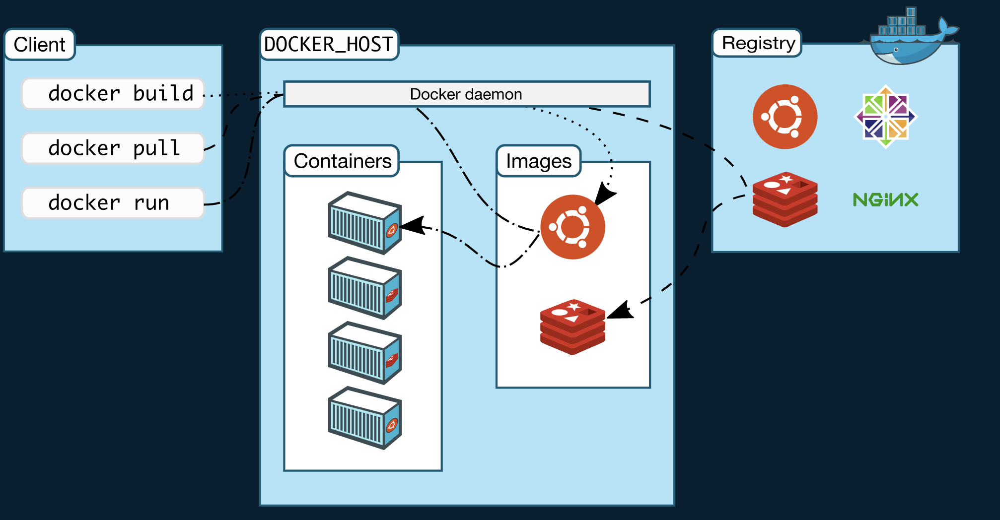
<h3 align="center">Fonte: https://docs.docker.com/get-started/overview/</h3>
</p>

O Docker usa uma arquitetura cliente-servidor. 

O cliente Docker conversa com o daemon do Docker, que faz o trabalho pesado de construir, executar e distribuir seus contêineres Docker. 

O cliente e o daemon do Docker podem ser executados no mesmo sistema ou você pode conectar um cliente do Docker a um daemon remoto do Docker.

O cliente Docker e o daemon se comunicam usando uma API REST, em soquetes UNIX ou uma interface de rede. 

Outro cliente do Docker é o Docker Compose, que permite trabalhar com aplicativos que consistem em um conjunto de contêineres.

> Componentes do Docker
- Docker Daemon
- Docker Client
- Docker Registries
- Docker Objects
    - Images
    - Containers

### Instalação
- Para Windows
    - Instalar Docker Desktop on Windows, com WSL2 ou Hyper-V (que exige Windows 10 Pro) habilitados

    > ****Instalar o WSL:**** [https://docs.microsoft.com/pt-br/windows/wsl/install](https://docs.microsoft.com/pt-br/windows/wsl/install)

    > Esse arquivo restringe a memória consumida. Extensão .wslconfig -temos que salvar na pasta do usuário

    ```markdown
    [wsl2]
    memory=2GB # Any size you feel like
    swap=0
    localhostForwarding=true.wslconfig
    ```

- Para Linux
    - Instalar Docker Engine pelo site oficial
- Para MacOs
    - Instalar Docker Descktop for Mac pelo site oficial

> [Documentação do do site oficial](https://docs.docker.com/get-docker/)

### Docker Imagens e Docker Containers

Um Docker Image é um template que permite a criação de um container Docker, através de um conjunto de instruções.

Uma analogia simples seria o de uma classe e instância:

    - Uma classe contém o template, com dados e comportamentos, enquanto uma instância é um objeto real baseado nela, em memória.

    - Um container é uma instância em execusão de um Doker Image.

Sobre Docker Images

- O Docker Images podem incluir código, arquivos de configuração, bibliotecas, runtimes, e variáveis de ambiente.

- Uma imagem pode ser utilizada em qualquer host que tenha suporte a Docker, fornecendo a portabilidade e agilidade entre ambientes.

Já containers são executados a partir de imagens, e executam em cima do sistema operacional (host), compartilhando o seu kernel. 

### Docker files

- São usados para que o Docker gere iamgens a partir deles
- Basicamente, é um arquivo de texto que contém todas as instruções necessárias para construir uma imagem
- A imagem é construída a partir do comando 
    ```powershell
    docker build -t nomeimagem
    ```

## Começando

### Criando Dockerfile

Para criar um Dockerfile é simples, basta criar um arquivo com o nome `Dockerfile``

No arquivo criado iremos definir uma instrução obrigatória, que indica qual imagem será utilizada como base para ser modificada usando o `FROM`:

```docker
FROM mcr.microsoft.com/dotnet/aspnet:6.0-alpine
```
O comando acima indica que será criado uma imagem com .NET 6.0

Utilizando instrução `LABEL` para definir informações para a imagem como versão, descrição e autor (opicional).
```docker
LABEL version="1.0.0" description="Disponibilizando API Docker Demo" maintainer="Nathaly Mesquita<nnathalygm@gmail.com>"
```
Definimos as informações que eram necessárias, sendo elas: Versão (version), descrição (description) e autor/responsável (maintainer).

Copiando o projeto para a imagem. 
Sabemos que o dotnet armazena os seus binários no seguinte caminho: bin/Release/net6.0/publish após ter executado `dotnet publish  --configuration Release`, utilizando a instrução `COPY` passando o nome do arquivo ou pasta que pretendemos copiar seguida pelo caminho onde as mesmas devem ser copiadas:
```docker
COPY bin/Release/net6.0/publish App/
```
Repare que estamos copiando os arquivos localizado dentro da pasta publish para o caminho do App/

O próximo passo é definir uma pasta dentro do container onde os comandos serão executados (pasta que irá conter a aplicação).
Ela é a pasta que será direcionado quando acessarmos nosso container, para fazer isso podemos utilizar a instrução `WORKDIR`passando a pasta:
```docker
WORKDIR /App
```

Por fim, definiremos o aplicativo padrão usado toda vez que um contêiner é criado a partir da imagem, usando a instrução `ENTRYPOINT`:
```docker
ENTRYPOINT [ "dotnet", "Docker.Demo.dll" ]
```

Segue o arquivo final:
```docker
FROM mcr.microsoft.com/dotnet/aspnet:6.0-alpine

LABEL version="1.0.0" description="Disponibilizando API Docker Demo" maintainer="Nathaly Mesquita<nnathalygm@gmail.com>"

COPY bin/Release/net6.0/publish App/

WORKDIR /App

ENTRYPOINT [ "dotnet", "Docker.Demo.dll" ]
```
> [Documentaçõ oficial](https://docs.docker.com/samples/dotnetcore/)

### Construindo e rodando a imagem Docker
Abra um prompt de comando e navegue até a pasta do seu projeto.
Use o seguinte comando para criar sua imagem do Docker:
```docker
docker build -t formacao-devops .
```
<br />
<p align="center">
<h3 align="center">Após a execução</h3>
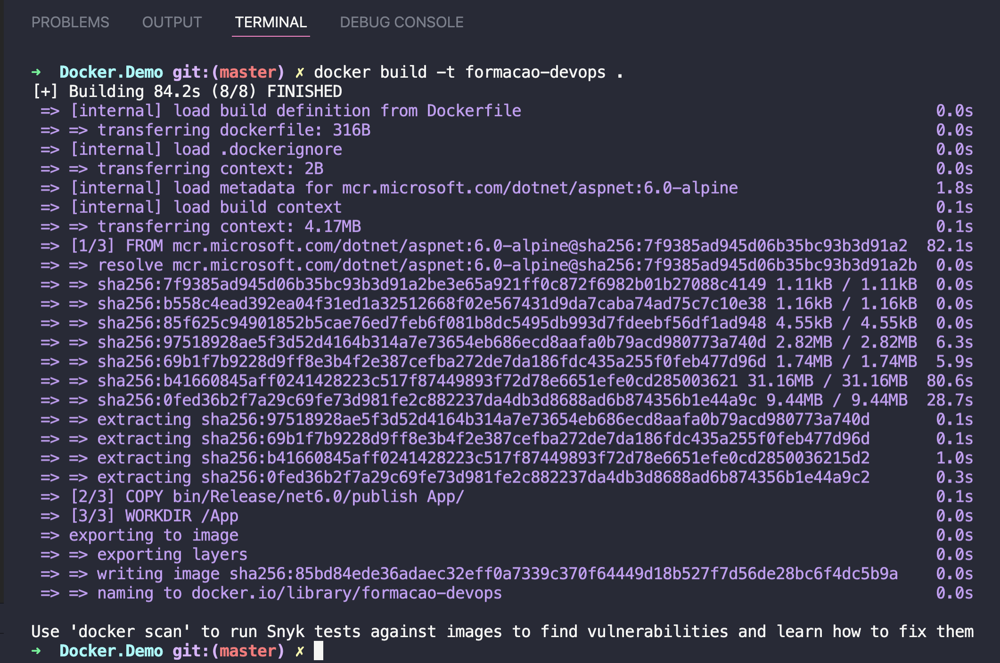
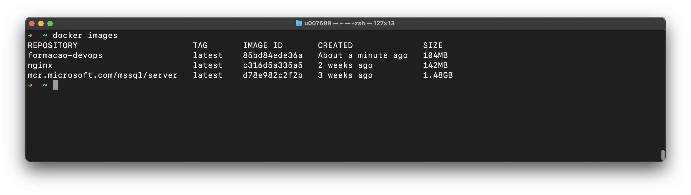
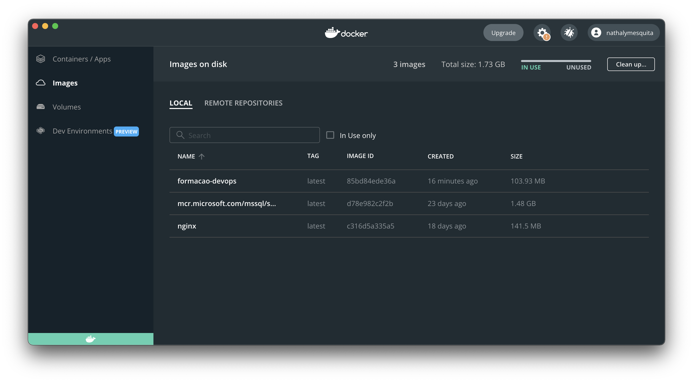
</p>

Use o seguinte comando para executar sua imagem do Docker:
```docker
docker run -d -p 5000:80 --name Decker.Demo formacao-devops
```
```markdown
<comando> <parâmetro> "<porta-host>:<porta-container>" <parâmetro> 
```
<br />
<p align="center">
<h3 align="center">Após a execução</h3>
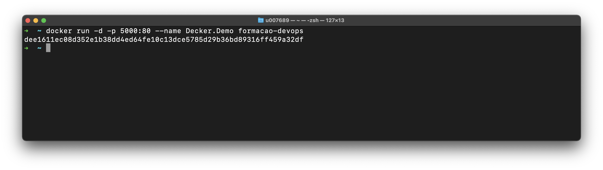
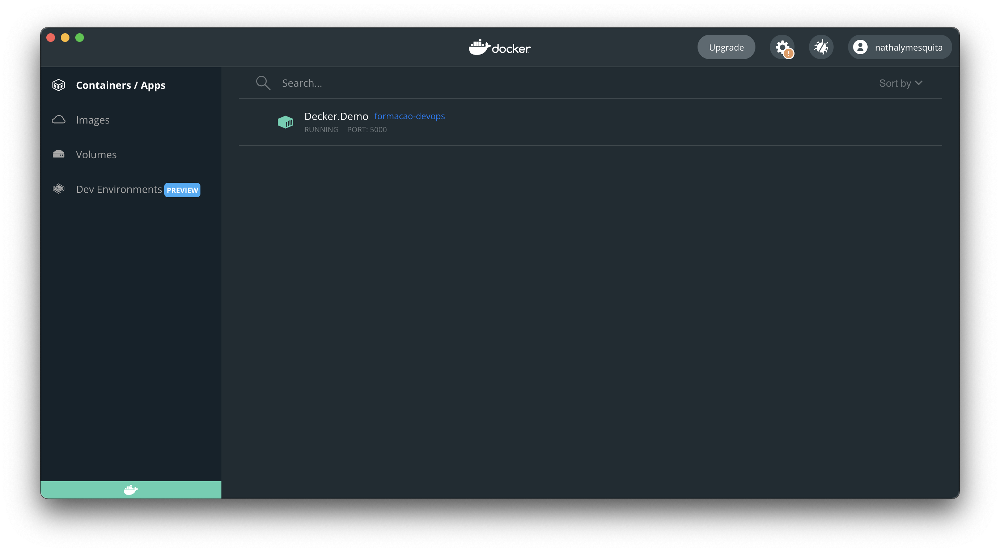
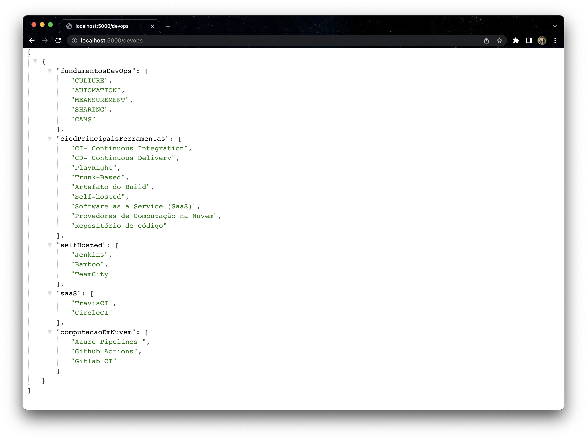
</p>


| Parâmetro  | Explicação  | 
|---|---|
| -d  | Execução do container em background  | 
|  --name | Nomear o container  |
| -p | Mapeamento de porta|

### Publicando imagem no docker hub
Primeiro crie uma conta no [Docker Hub](https://hub.docker.com/)

Faça login utilizando o seu `DockerID`
```docker
docker login -u <seu-docker-id>
```
<br />
<p align="center">
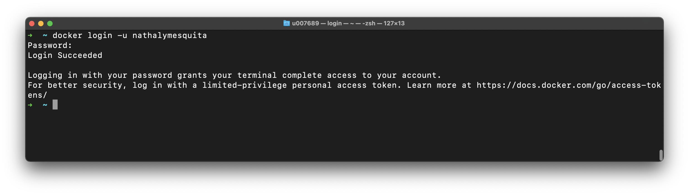
</p>

Crie um repositório no [Docker Hub](https://hub.docker.com/):
<br />
<p align="center">
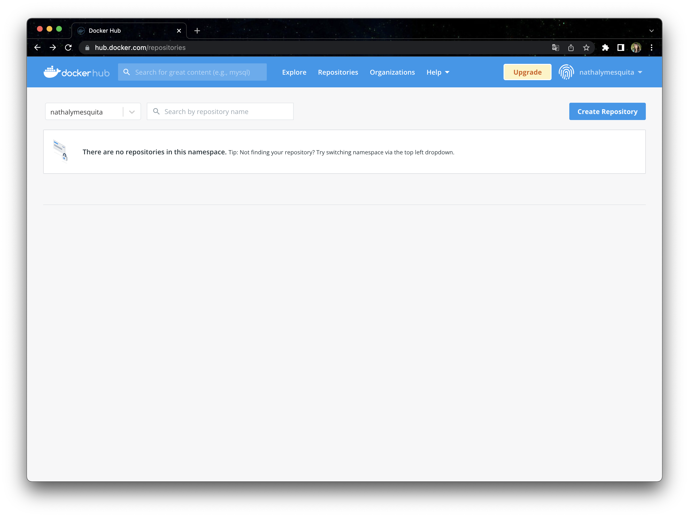
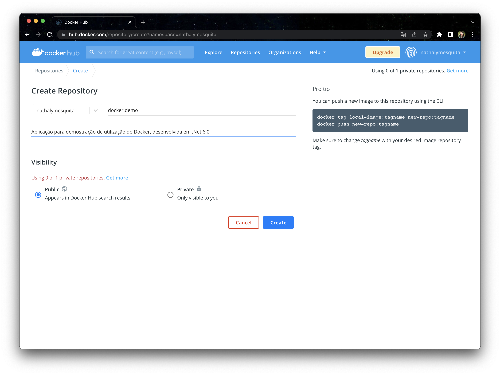
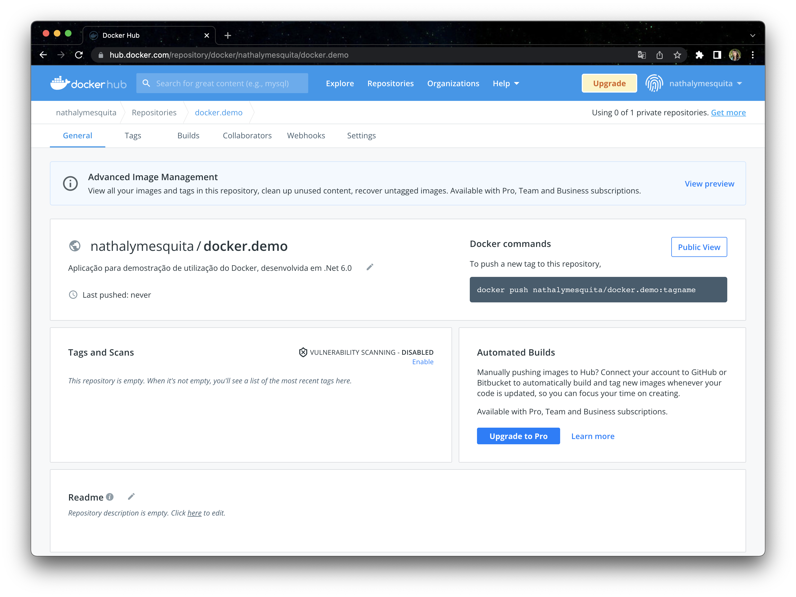
</p>

Iremos alterar o nome da `TAG`para adequar com o nome do repositório criado com o seguinte comando:
```docker
docker tag <imagem-existente> <imagem-nova-repositorio-criado>
```
<br />
<p align="center">
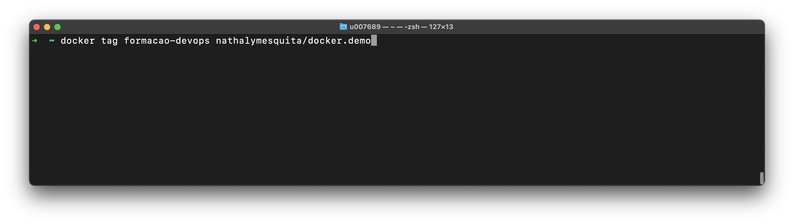
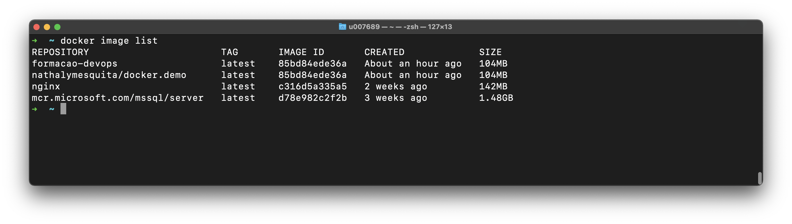
</p>

Observe que o nome da nossa imagem criada anteriomente era `formacao-devops`e foi criada uma nova imagem com o nome `nathalymesquita/docker.demo`.
Execute a publicação com o seguinte comando:
```docker
docker push <imagem-nova-com-nome-do-repositorio-criado>
```
<br />
<p align="center">
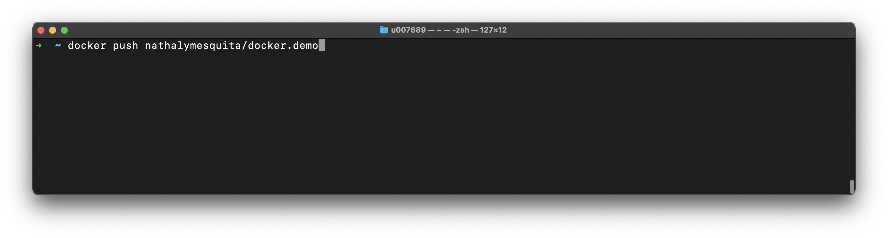
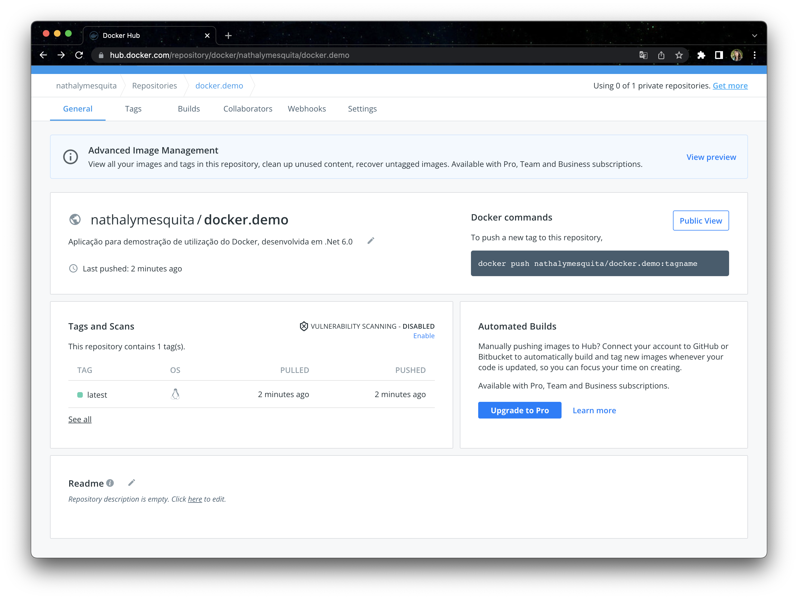
</p>


### Como baixar uma Docker image
Para baixar uma imagem, basta utilizar o comando:

```powershell
docker pull [PARAMETROS] NOME[:TAG]
```
No comando `docker run` , caso a imagem referênte ao container não exista, uma tentativa de baixar será realizada durante a execução.

Inicialmente removi todas as referências de imagens criadas desta aplicação com os seguintes comandos:
```docker
docker ps --all
docker container stop 4ca6d09c1103
docker container rm 4ca6d09c1103
docker image list
docker image rm test-image
```
<br />
<p align="center">
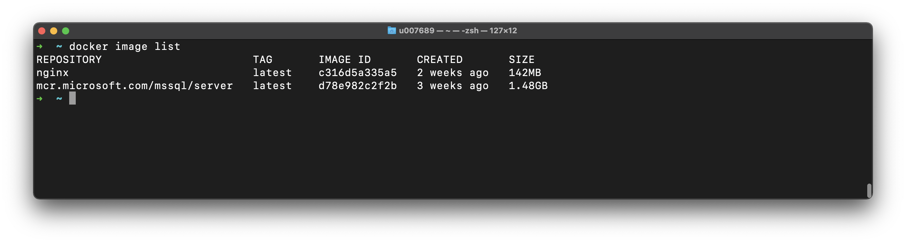
</p>

Para utilizar a imagem publicada no docker hub utilizaremos os seguintes comandos:
```docker
docker pull nathalymesquita/docker.demo
docker run -d -p 5000:80 --name docker.hub.demo nathalymesquita/docker.demo
```

<br />
<p align="center">
<h3 align="center">Resultado</h3>
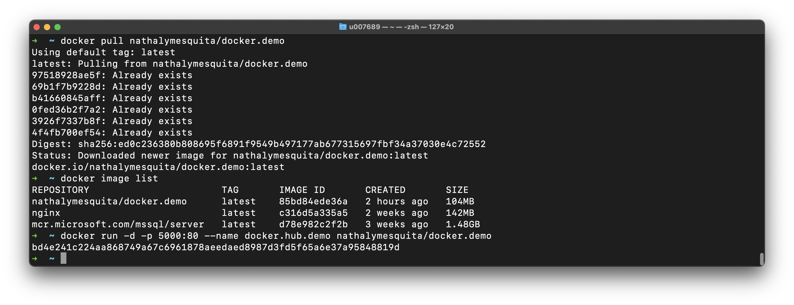
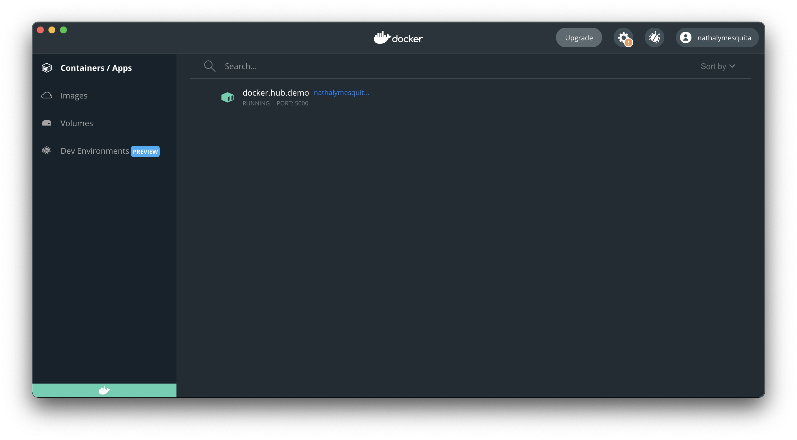
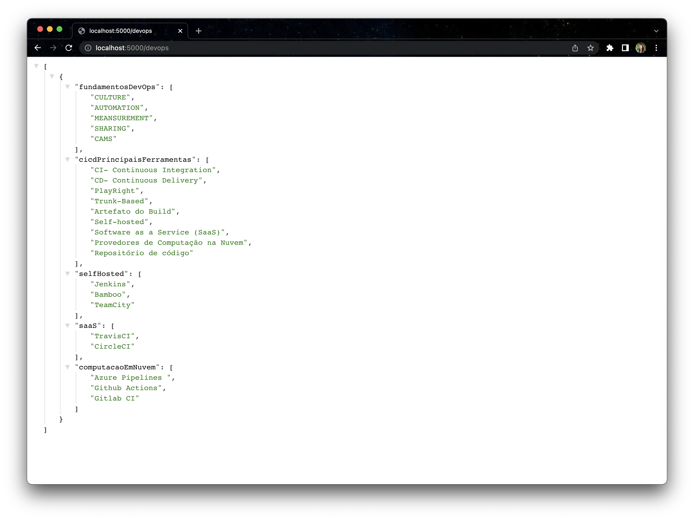
</p>


### Comandos básicos do docker

Abaixo segue a lista com os principais comandos do docker que utilizamos.


|                    Comando | Conteúdo                                                                      |
| -------------------------: | ----------------------------------------------------------------------------- |
|                    `docker build -t nome_da_imagem →` | Gera uma imagem a partir de um Dockerfile                                             |
|                    `docker images  →` | Lista as imagens disponíveis no host                                             |
|           `docker run nome_da_imagem →` | Cria um conteiner a partir dessa imagem constrída                    |
|           `docker login →` | Registra ou faz o login em um servidor de registry                    |
|                    `docker pull →` | Faz o pull de uma imagem a partir de um servidor de registry                                             |
|                    `docker push  →` | az o push de uma imagem a partir de um servidor de registry                                          |
|                    `docker rm  →` | Remove um ou mais containeres                                          |
|                    `docker stop  →` | Para um container que esteja rodando                                          |
|                    `docker tag   →` | Coloca tag em uma imagem para o repositorio                                         |

<!-- CONTRIBUTING -->

## Contribuição

Contribuições são o que fazem a comunidade open source um lugar incrível para aprender, inspirar e criar. Qualquer contribuição que você fizer será **muito apreciada**.

1. Faça um Fork do projeto
2. Crie uma Branch para sua Feature (`git checkout -b feature/FeatureIncrivel`)
3. Adicione suas mudanças (`git add .`)
4. Comite suas mudanças (`git commit -m 'Adicionando uma Feature incrível!`)
5. Faça o Push da Branch (`git push origin feature/FeatureIncrivel`)
6. Abra uma Pull Request

<!-- LICENSE -->

## Licença

Distribuído sob a licença MIT. Veja `LICENSE` para mais informações.

<!-- CONTACT -->

## Contato

Nathaly Mesquita - [Github](https://github.com/nathy-mesquita) - **nnathalygm@gmail.com**